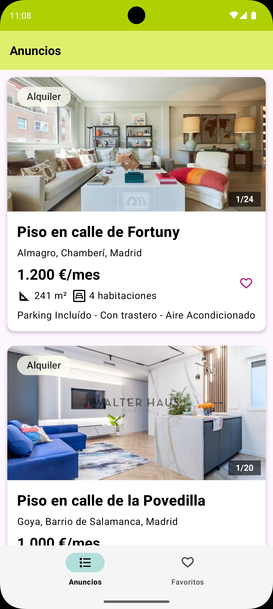
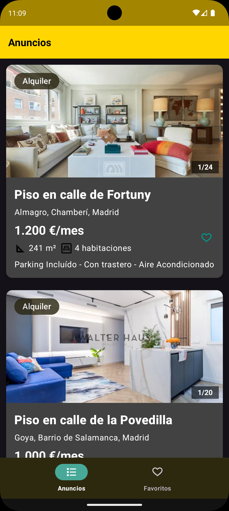
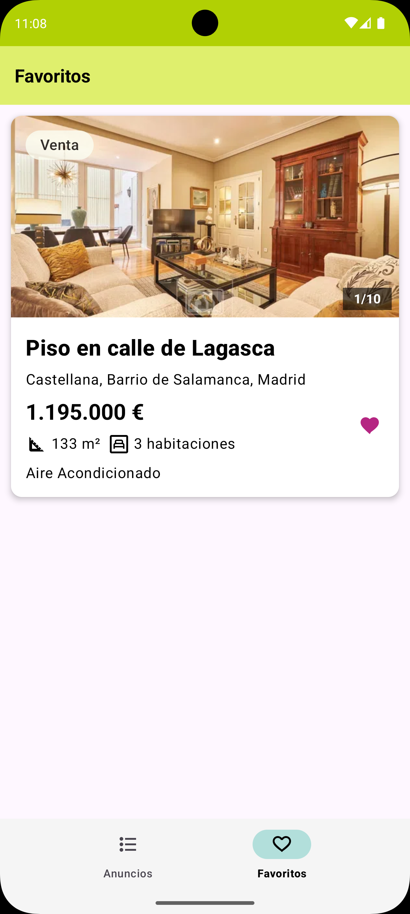
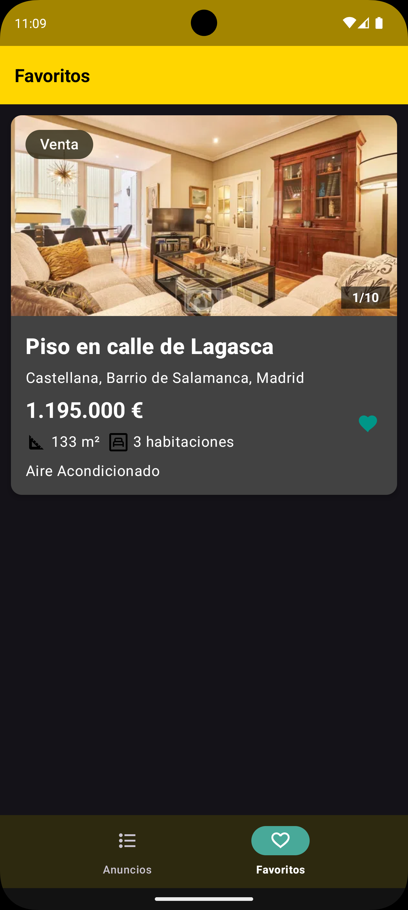
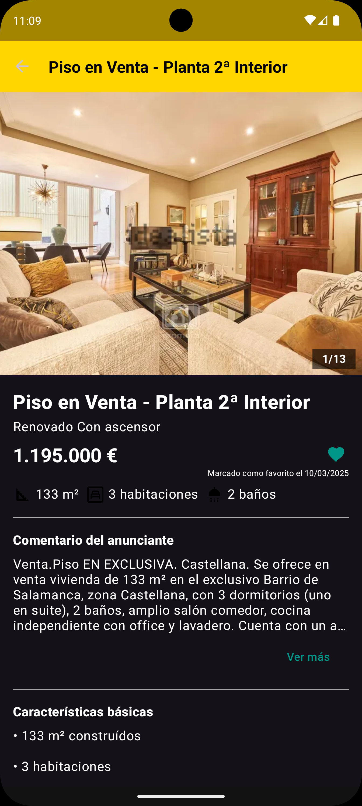

# 📱 Idealista Android Challenge

Welcome to the **Idealista Android Challenge**, an Android application for browsing real estate
listings. This project is developed in Kotlin with a modular architecture, following Clean
Architecture principles and MVVM design pattern. The app allows users to explore property listings,
view detailed information, and mark properties as favorites.

## 🏗️ Architecture and Project Structure

This project follows Clean Architecture principles and is structured into different modules:

```
📂 idealista-android-challenge
│── build-logic/              # Gradle build logic configuration
│── app/                      # Main application module
│── features/ads/             # Independent feature modules
│   ├── list/                 # Property listing screen
│   ├── detail/               # Property detail screen
│   ├── favorites/            # Favorite properties screen
│── libraries/                # Reusable libraries
│   ├── ads/                  # Shared presentation, domain and data modules for ads
│   ├── design/               # UI components and design resources
│   ├── navigation/                # General utilities
│── gradle/                   # Gradle configuration
│── README.md                 # Project documentation
```

## 🚀 Main Features

- Property Listings with images, prices, and descriptions
- Detailed Property View with complete information
- Favorite Listings with persistence
- Error Handling and Loading States
- Modular Clean Architecture
- Reactive Data Flow using Kotlin Flow and Coroutines
- Unit Testing with JUnit5, MockK, and Turbine

## 📸 Screenshots

Here are some previews of the app in both **Light Mode** and **Dark Mode**.

### 🏡 Ads
| Light Mode                            | Dark Mode                           |
|---------------------------------------|-------------------------------------|
|  |  |

### ⭐ Favorites
| Light Mode | Dark Mode |
|------------|------------|
|  |  |

### 🏠 Details
| Light Mode                              | Dark Mode                             |
|-----------------------------------------|---------------------------------------|
|  |  |

---

## 🛠️ Technologies Used

- Kotlin – Main programming language
- Jetpack ViewModel – State management
- StateFlow – Reactive UI state
- Hilt – Dependency injection
- Coroutines & Flow – Asynchronous programming
- Retrofit – API communication
- Datastore – Local storage
- Material Design – Modern UI
- MockK & Turbine – Unit testing

## 🏗️ Installation & Setup

### 🔹 Prerequisites

1. Install Android Studio Hedgehog (or newer)
2. Ensure Java 17 or higher is installed
3. Clone the repository:

```
git clone https://github.com/yourusername/idealista-android-challenge.git
cd idealista-android-challenge
```

4. Open the project in Android Studio
5. Compile and run on an emulator or physical device

## 🏛️ Architecture Details

### 🔹 Core Principles

- Separation of Concerns: Clear distinction between UI, business logic, and data layers.
- Single Responsibility Principle (SRP): Each module/class has a dedicated responsibility.
- Dependency Injection with Hilt: Efficient dependency management.

### 🔹 Layered Architecture

📌 1. **UI (Presentation Layer)**

- Composed of Activities, Fragments, and ViewModels.
- Uses StateFlow for state management.

📌 2. **Domain Layer**

- Contains Use Cases handling business logic.
- Interacts with repositories without depending on specific technologies.

📌 3. **Data Layer**

- Defines repositories and interacts with data sources (API, Datastore).
- Uses Retrofit for API calls.

## 📌 Main Modules

📂 features/ads/list

Property listings where users can explore various real estate ads.

📂 features/ads/detail

Displays detailed property information.

📂 features/ads/favorites

Section for managing favorite listings.

## 🛠️ Handling API Limitations
The API provides static JSON data for both listings and details, meaning the data is not dynamically fetched per property.
This posed a challenge in maintaining a realistic experience.

There were two possible approaches:

1. Share data from the selected list item to show in the detail screen.

🔴 Issue: The detail view would mix data from different listings, leading to inconsistency.

2. Always display the same detail screen regardless of the selected property.

✅ Solution Chosen: Maintains data consistency, even though it means clicking different properties leads to the same details.

_While neither solution is ideal, consistency was prioritized to ensure a reliable experience._

## 🧪 Testing

The project includes comprehensive unit tests using JUnit5, MockK, and Turbine.

Run tests using:

```
./gradlew test
```

## 📌 Future Improvements

📌 Increase Test Coverage – More unit and UI tests (e.g., Espresso, E2E tests).

📌 Better Animations – Smoother transitions and motion effects.

📌 Enhanced Error Handling – Improved messaging for API failures.

📌 Improved Loading States – Skeleton loading screens.

📌 Offline-First Strategy – Cache data for a better user experience. Consider Room for improved offline support.

## 🎯 Contribution

If you'd like to contribute, follow these steps:

1. Fork this repository
2. Create a new branch (git checkout -b feature/new-feature)
3. Make changes and commit (git commit -m "Add new feature")
4. Push to your fork (git push origin feature/new-feature)
5. Create a Pull Request 🎉